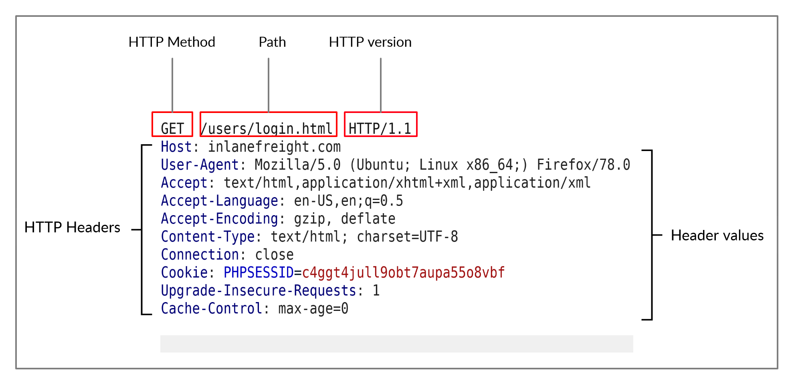
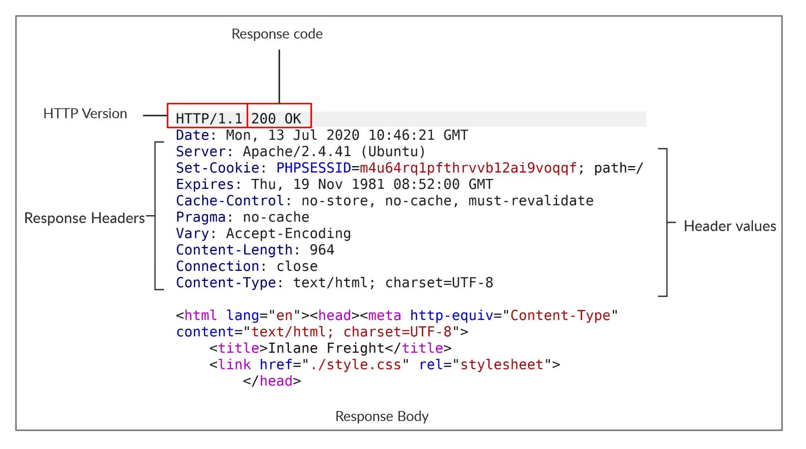

# Day 1 of learning Bug Bount

## Title: Web Request

### 1. HTTP Request and Responses

- **Request**

- **Responses**

**Curl** or **Dev Tool** can be used to access this request and responses.

### 2. HTTP Headers
Headers can be categories into followings:

- General Headers: Used in both **req** and **res**, used to describe the message rather than it's content. For example **Date** and **Connections**

- Entity Headers: Used in both **req** and **res**, used to describe the content transferred by message. For example Content-Type, Media-Type, Boundary, Content-Length and Content-Encoding

- Request Headers: Used in HTTP request and do not relate to the request data, for example: Host, User-Agent, Refer, Accept, Cookies, Authentication

- Response Headers: Used in HTTP response and do not relate to the response data, for example: Server, Set-Cookies, WWW-Auth

- Security Headers: A class of oresponse headers used to specify certain rules and policies. For Example: Content-Security-Policy, Strict-Transport-Security, Referrer-Policy.

### 3. HTTP Methods and Codes
### 4. CURL API

